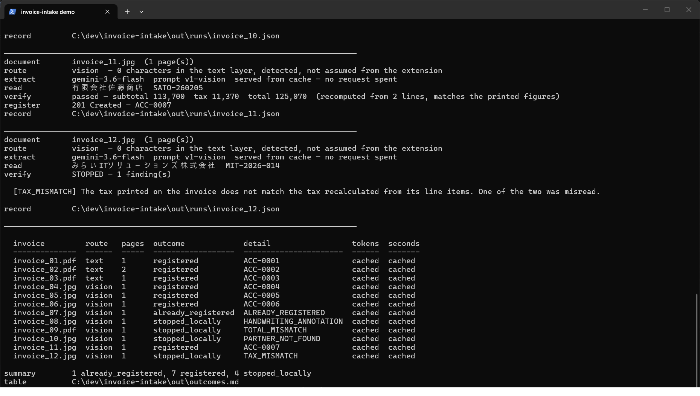
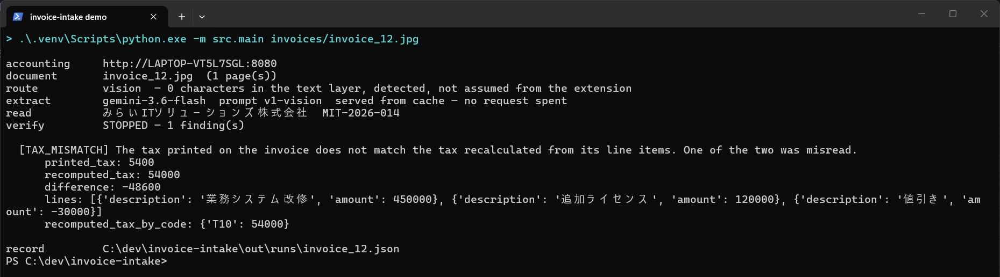
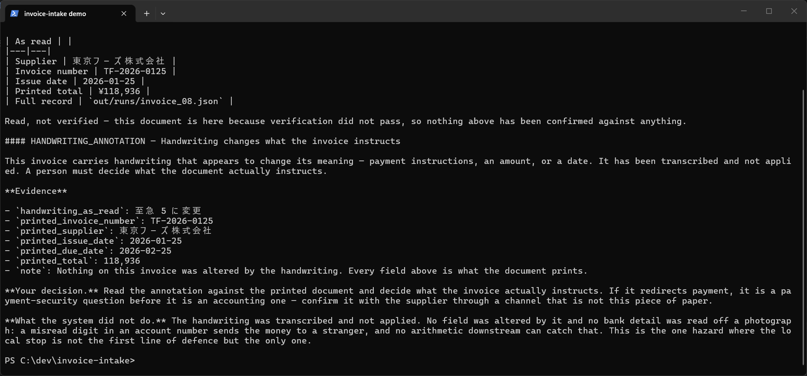
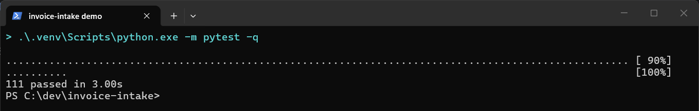
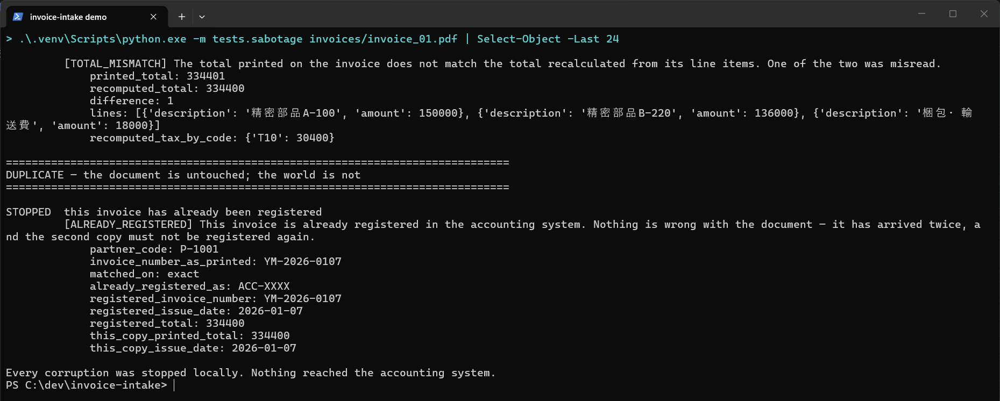

# 🧾 Invoice Intake


Reads Japanese supplier invoices (PDFs, scans, and scanned PDFs), verifies what was read,
and registers it into an existing accounting system. Anything that cannot be verified goes
to a human instead of into the ledger.

> **Status: a working core, not a product.** The whole folder runs end to end. Both routes,
> all twelve documents, each one routed, extracted, verified against the accounting
> system's own arithmetic and master data, then either registered or handed to a person
> with a reason and the evidence for it. What is deliberately *not* here is recorded and
> defended in `SUBMISSION.md` section 3 rather than quietly filled in. The largest absence
> is a review screen: the queue behind one is built, the screen is not.

## 📋 <a name="table">Table of Contents</a>

1. 📘 [Introduction](#introduction)
2. ⚙️ [Tech Stack](#tech-stack)
3. ⭐ [Features](#features)
4. 🚀 [Quick Start](#quick-start)
5. 🧠 [How It Works](#how-it-works)
6. 🧪 [Tests](#tests)
7. 📸 [Demo](#demo)
8. 🗂️ [Layout](#layout)
9. 🔗 [Links](#links)

## 📘 <a name="introduction">Introduction</a>

Accounting staff retype supplier invoices into an accounting system by hand, every month,
one at a time. It is slow, and last month a typo nearly caused the same invoice to be paid
twice.

Automating the typing alone would make that worse, not better. Hand entry is slow, but a
person looks at every document before it becomes a payment. Replace them with a model and
you have removed the only check in the process, leaving something that will read 5,400
where the invoice says 54,000 and never mention it.

So this project registers an invoice automatically **only when its numbers can be
checked**, and stops everything else locally, with a reason, before it reaches the
accounting system. Against the twelve sample invoices: **7 register on their own, 1 is
caught as a duplicate, and 4 go to a review queue.** The accounting system rejects nothing,
because every stop happens on this side of the boundary.

## ⚙️ <a name="tech-stack">Tech Stack</a>

- **Python 3.9+**
- **Google Gemini Flash** (free tier) for extraction, behind a single function so it is not
  load bearing
- **PyMuPDF** for text-layer detection and page rendering, one dependency instead of two
- **Pydantic** for the extraction schema, so an integer yen amount is a type error rather
  than a code review comment
- **pytest** for a suite that runs entirely offline
- **Standard library only** for the mock accounting system, exactly as the assignment ships it

## ⭐ <a name="features">Features</a>

- 🧾 **Reads three document kinds.** Text-layer PDFs, scanned images, and PDFs that contain
  nothing but a scan.
- 🔀 **Routes on content, never on file extension.** A `.pdf` with no text layer is detected
  and sent to the vision route. Sending a readable PDF to a vision model pays image prices
  for text already in hand.
- 🧮 **Recomputes every amount from the line items** using the accounting system's own
  formula, including its floating-point rounding, so the numbers submitted are ones already
  reproduced rather than ones read off the paper.
- 🏢 **Matches suppliers against the partner master** by registration number, name, and
  registered alias, with width normalisation. Nothing is ever created, and no near miss is
  accepted as a match.
- 🗓️ **Normalises Japanese dates once, at extraction.** `令和8年2月5日`, `2026年1月7日` and
  `2026/01/18` all become `YYYY-MM-DD`, and nothing downstream sees any other shape.
- 🔁 **Catches duplicates locally** on `(partner_code, invoice_number)` before submitting,
  rather than by catching the accounting system's `409`.
- ✍️ **Detects handwriting and never interprets it.** A received stamp stays out of the
  payload. A note changing bank details goes in front of a person.
- 📋 **Writes a review queue** carrying what was read, which check stopped it, the evidence,
  the decision that belongs to a person, and what the system declined to do on its own.
- 💾 **Caches raw model output on disk** before parsing, so re-running costs no API requests.

## 🚀 <a name="quick-start">Quick Start</a>

### Prerequisites

- Python 3.9 or newer
- A **Google AI Studio API key**. Free tier, no card required, about two minutes at
  <https://aistudio.google.com/apikey>

### Clone

```bash
git clone https://github.com/Sumit-531/invoice-intake.git
cd invoice-intake
```

### Installation

```bash
python -m venv .venv
.venv\Scripts\activate          # Windows
# source .venv/bin/activate     # macOS / Linux
pip install -r requirements.txt
```

### Environment Setup

```bash
cp .env.example .env
```

Then put your key in `.env`:

```env
GEMINI_API_KEY=your_key_here
```

If something on your machine already owns port 8080 on loopback, also set
`ACCOUNTING_API_URL`. `accounting_api.py` binds `0.0.0.0`, so it stays reachable on the
machine's own hostname:

```env
ACCOUNTING_API_URL=http://YOUR-HOSTNAME:8080
```

### Running the Project

Two terminals. The accounting system runs in one, the pipeline in the other.

**1. Start the mock accounting system** (no dependencies):

```bash
python accounting_api.py
```

**2. Run the pipeline** over the whole set:

```bash
python -m src.main invoices/
```

Or over a single document, which prints the full evidence for every finding:

```bash
python -m src.main invoices/invoice_12.jpg
```

A batch ends with a per-invoice outcome table, also written to `out/outcomes.md`. It exits
`0` when every document reached a decision, registered or stopped with a reason, and `2`
when any did not. **A stopped invoice is a correct outcome, not a failure of the run.** A
full pass registers 7, stops 1 as a duplicate, and sends 4 to a person. A run reporting 12
of 12 registered would mean something was wrong.

A single-document run exits `0` when the invoice was registered and `1` when it was
stopped. Either way, the findings and evidence go to `out/runs/<name>.json`.

Extraction is cached on disk and keyed by file content, so re-running costs no API requests
and takes seconds. Uncached calls in a batch are spaced 13 seconds apart to stay inside the
free tier's limit of 5 per minute.

### Testing

```bash
pytest
```

## 🧠 <a name="how-it-works">How It Works</a>

```
invoices/  →  route  →  extract  →  verify  →  register  →  accounting API
                                       │
                                       └──  review queue  →  a human
```

- **route** reads a PDF with a usable text layer as text, and renders everything else for a
  vision model. The decision is made on detected content, never on the file extension.
- **extract** makes one model call per document, into a typed schema. The raw response is
  written to disk before anything parses it.
- **verify** is deterministic, offline, and free. Amounts are recomputed from the line items
  using the accounting system's own formula, the supplier is matched against the partner
  master, dates are normalised, and duplicates are caught before anything is submitted.
- **register** POSTs only invoices that passed every local check.
- **review queue** takes everything else, each with a structured reason and the evidence for
  it, so a person can act without reopening the source document.

Not every invoice can be registered, and that is by design rather than by failure. A
supplier absent from the partner master, or a second copy of an invoice already entered, is
a decision for a person, not something to retry until it succeeds.

### The review queue

Everything that could not be registered ends up in one place:

```
out/review_queue.md      what needs a person, and what the system declined to do
out/review_queue.json    the same, structured
```

A batch writes it. It can also be rebuilt at any time from run records already on disk,
which needs neither an API key nor the accounting system running:

```bash
python -m src.review
```

Each item carries what was read, which check stopped it, the evidence, **the decision that
belongs to a person**, and, deliberately, **what the system did not do on its own**. A queue
that only lists faults invites "why didn't it just fix that?"; answering that in the same
breath is where the automation boundary gets written down.

A stopped duplicate is reported but not queued. Nothing is wrong with that document, and a
queue that sends reviewers after faults that do not exist is a queue that stops being read.

## 🧪 <a name="tests">Tests</a>

```bash
pytest
```

A hundred and eleven tests, all offline. **No API key, no running accounting system, no
network.** That is a property of the design rather than of the tests: `verify/` is pure, so
every check can be run against a fabricated invoice for free.

| File | What it covers |
|---|---|
| `tests/test_contract.py` | The structural claims `CLAUDE.md` makes about this codebase: that `verify/` is pure, that nothing branches on a sample filename, that no amount is a float. Static analysis of the source itself. |
| `tests/test_verify.py` | Each check watched failing on a corrupted extraction. A sign flipped, a row dropped at a page break, a digit slipped, an era year converted wrongly, the same invoice arriving twice in two formats. |
| `tests/test_routing.py` | Renames a text-layer PDF to `.jpg` and asserts the route does not move, and the reverse. |
| `tests/test_review.py` | The queue built from fabricated run records, including a reason code the guidance table has never met and a document that stopped without recording why. |

There is also a sabotage driver, which corrupts a real extraction eleven ways and shows each
one stopped:

```bash
python -m tests.sabotage invoices/invoice_01.pdf
```

## 📸 <a name="demo">Demo</a>

**The full batch, twelve documents end to end**


_Every document routed, extracted, and verified. `invoice_11` registers as `ACC-0007` with
its amounts recomputed from the line items; `invoice_12` stops on `TAX_MISMATCH`. The run
ends with 7 registered, 1 already registered, and 4 stopped locally._

**A misread caught by arithmetic, not by a second opinion**


_The model read the tax as 5,400 where the line items give 54,000. The subtotal and the
total both agreed with the document, so a verifier that only compared totals would have let
this through. Recomputing tax per tax code is the only reason it stopped._

**The review queue, where a document needs a person**


_Every number on `invoice_08` verifies correctly, and it still must not register: the bank
account is struck through in red with a change written beside it. No API field carries bank
details, so nothing downstream could ever catch this. The handwriting is transcribed and
never applied._

**The test suite, offline and free**


_A hundred and eleven tests in three seconds, with no API key and no accounting system
running._

**Sabotage: every check watched failing**


_A correct extraction corrupted eleven ways, one at a time. A check nobody has watched fail
is not a check, it is a hope._

## 🗂️ <a name="layout">Layout</a>

| Path | |
|---|---|
| `src/extract/` | Document to structured data. The only place a model is called. |
| `src/verify/` | Pure functions. No I/O, no model, no network. |
| `src/register/` | The accounting API client. |
| `src/review/` | The human queue: what could not be automated, and why. |
| `invoices/` | Sample input. Read-only. |
| `out/` | Run artifacts: raw responses, extractions, decisions. Gitignored. |
| `screenshots/` | The images used in this README. |
| `accounting_api.py` | The mock accounting system, verbatim from the assignment. Unmodified. |
| `CLAUDE.md` | The engineering contract this codebase is written against. |
| `SUBMISSION.md` | The submission document: scoping, design, verification, cost, and risk. |

`accounting_api.py` is included so this repository runs from a cold clone. Its behaviour is
not modified. It is treated as a system owned by another team.

## 🔗 <a name="links">Links</a>

- **Submission document**: [`SUBMISSION.md`](SUBMISSION.md)
- **Engineering contract**: [`CLAUDE.md`](CLAUDE.md)
- **Google AI Studio** (free API key): <https://aistudio.google.com/apikey>
